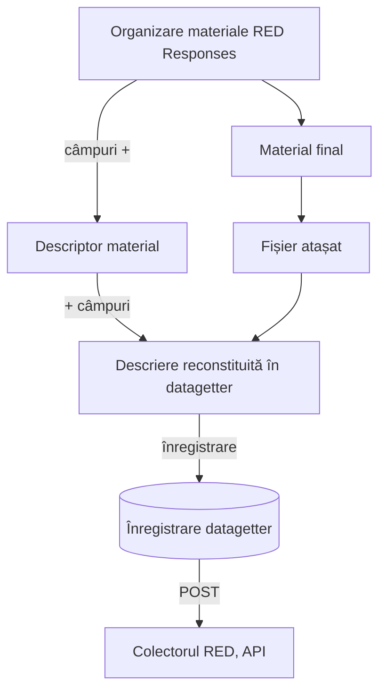

# Descrierea modulului

Acesta este modulul necesar preluării datelor din fluxul de contribuții ale experților RED și încărcarea acestora în Colectorul RED pentru afișare.

```mermaid
graph TD
    GSheet[Organizare materiale RED Responses] --câmpuri +--> DM[Descriptor material];
    GSheet --> MF[Material final];
    MF --> FA[Fișier atașat];
    DM --+ câmpuri--> DRC[Descriere reconstituită în datagetter];
    FA --> DRC;
    DRC --înregistrare--> RDG[(Înregistrare datagetter)];
    RDG --POST--> API[Colectorul RED, API];
```

